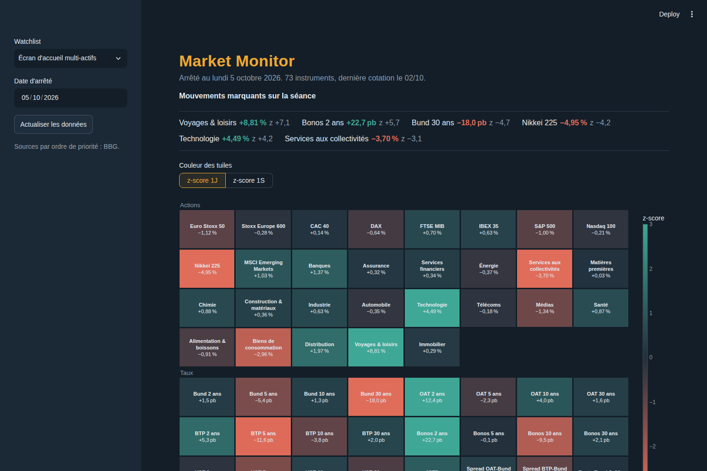
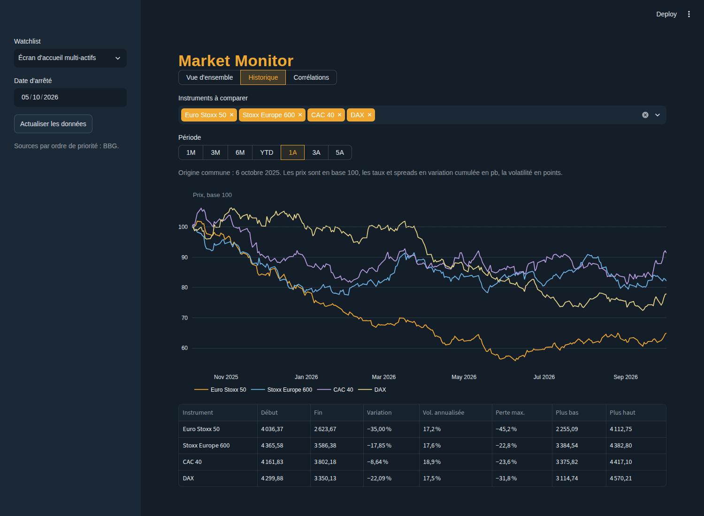
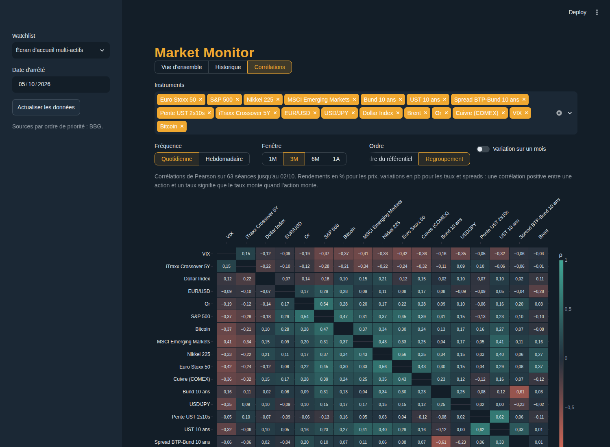
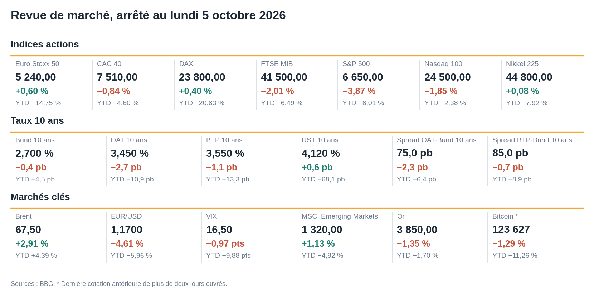
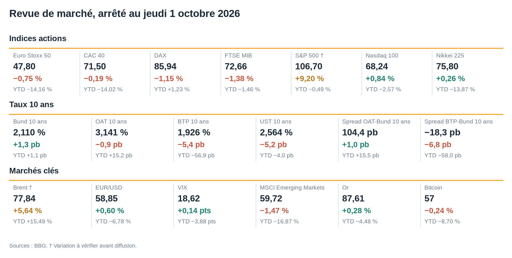
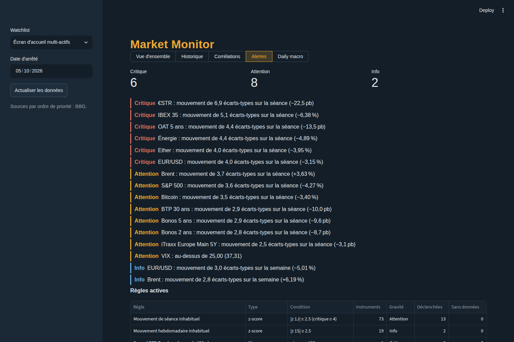

# Market Monitor

Écran d'accueil multi-actifs du mini terminal maison, dans l'esprit des écrans **WEI / WB /
FXC / CMDTY** de Bloomberg, et outil de préparation de la revue macro quotidienne d'un
gérant multi-asset : niveaux, variations 1J / 1S / MTD / YTD aux conventions de marché,
z-scores, heatmap, historiques, corrélations, alertes et export « daily macro » prêt à coller.



**Sommaire** : 1 Démarrage rapide · 2 Routine du matin · 3 Architecture · 4 Configuration ·
5 Données · 6 Référentiel · 7 Performances · 8 Dashboard · 9 Historique et corrélations ·
10 Export daily macro · 10.1 Contrôles avant publication · 11 Alertes ·
12 Intégration au terminal · 13 Ligne de commande · 14 Qualité · 15 Dépannage ·
16 Limites et évolutions

---

## 1. Démarrage rapide

```powershell
scripts\install.bat          # .venv, dépendances, copie de .env.example en .env
notepad .env                 # renseigner FMP_API_KEY
scripts\doctor.bat           # vérifie la configuration et teste une donnée par provider
scripts\dashboard.bat        # ouvre le dashboard dans le navigateur
```

Équivalent manuel (Python 3.11+) :

```powershell
py -3.11 -m venv .venv
.venv\Scripts\activate
pip install -e ".[dev]"
copy .env.example .env
market-monitor doctor --online
market-monitor ui
```

Bloomberg (poste avec Terminal ouvert et connecté) : `blpapi` n'est pas sur PyPI.

```powershell
pip install --index-url=https://blpapi.bloomberg.com/repository/releases/python/simple/ blpapi
```

Sans Terminal, `set MARKET_MONITOR_PROVIDERS=fmp,free` : les lignes que seul Bloomberg
couvre (courbes souveraines pays, iTraxx) sont alors signalées sans données.

Dans PyCharm : interpréteur `.venv`, `src` marqué *Sources Root*, pytest comme runner.

## 2. La routine du matin

1. **8h15, tâche planifiée** `scripts\daily_macro.bat` (Planificateur de tâches Windows :
   déclencheur quotidien, jours ouvrés ; action « Démarrer un programme » sur le `.bat` ;
   « Commencer dans » la racine du projet). Elle écrit
   `exports\daily_macro_<date>.xlsx / .png / .txt` et `exports\alerts_latest.json`, journalise
   dans `logs\market_monitor.log`, et renvoie le code 3 en cas d'alerte critique.
2. **Dashboard, vue d'ensemble** : bandeau d'alertes, mouvements marquants classés par
   $|z_{1J}|$, heatmap, tableaux par classe d'actifs.
3. **Vue Daily macro** : sans Bloomberg, saisir les iTraxx de la veille dans l'encart
   « Saisie manuelle » (§ 5.4). Texte prêt à coller (bouton de copie), PNG des bandeaux pour la
   page A4, Excel. Relire la section « À vérifier avant diffusion » (données manquantes,
   périmées ou issues d'un proxy) avant d'envoyer quoi que ce soit.
4. Au besoin, **Historique** et **Corrélations** pour illustrer un mouvement.

## 3. Architecture

```
market_monitor/
├── config/
│   ├── config.yaml               # paramètres (aucun secret)
│   ├── instruments.yaml          # référentiel : conventions + tickers par provider
│   ├── watchlists.yaml           # sélections d'instruments
│   ├── daily_macro.yaml          # bandeaux et règles de l'export
│   └── alerts.yaml               # règles d'alerte
├── .env                          # FMP_API_KEY (non versionné, voir .env.example)
├── .streamlit/config.toml        # thème du dashboard
├── app.py                        # streamlit run app.py
├── scripts/                      # install, doctor, dashboard, daily_macro, check (.bat)
├── src/market_monitor/
│   ├── config.py                 # chargement YAML + .env, validation, journalisation
│   ├── exceptions.py             # hiérarchie d'erreurs
│   ├── referential.py            # référentiel et watchlists
│   ├── monitor.py                # façade MarketMonitor (point d'entrée unique)
│   ├── text_format.py            # nombres et dates à la française
│   ├── doctor.py                 # diagnostic d'installation
│   ├── cli.py                    # ligne de commande
│   ├── data/                     # providers, cache, service multi-sources
│   │   ├── models.py · base.py · quality.py · cache.py · cached_provider.py
│   │   ├── service.py · factory.py
│   │   └── providers/            # bloomberg.py · fmp.py · free.py
│   ├── analytics/                # history.py · performance.py · comparison.py · correlation.py
│   ├── alerts/                   # rules.py · engine.py
│   ├── export/                   # layout.py · builder.py · excel.py · image.py · text.py
│   └── ui/                       # seule couche qui importe Streamlit
├── tests/                        # 204 tests pytest, 100 % hors ligne
├── docs/                         # captures (données synthétiques)
└── .github/workflows/ci.yml      # lint, typage, tests sous Windows et Linux
```

Principes :

* **Le moteur ignore Streamlit.** Données, analytics, alertes et exports sont du Python pur,
  testé sans navigateur ; l'UI n'appelle que `MarketMonitor`.
* **Identifiants canoniques** (`SX5E`, `BUND_10Y`, `OAT_BUND_10Y`) partout au-dessus de la
  couche de données ; chaque provider garde son propre namespace (`SX5E Index`, `^STOXX50E`).
* **Fallback par instrument, pas par provider** : si Bloomberg sert le SX5E mais pas
  l'€STR, seul l'€STR part sur le provider suivant.
* **Les conventions vivent dans le référentiel**, pas dans le code : unité, sens de lecture
  (% ou pb), conversions d'échelle, proxies, instruments dérivés.
* **Rien d'implicite sur les données** : jamais de 0 à la place d'un trou, forward-fill
  toujours borné et explicite, chaque ligne porte sa source et sa date.

```
Dashboard / CLI / tâche planifiée
        │
        ▼
  MarketMonitor ──► Referential (YAML) ──► PerformanceEngine ──► Alertes, Export
        │
        ▼
  MarketDataService ──► CachedProvider(Bloomberg) ──► blpapi
      (fallback)    └──► CachedProvider(FMP)       ──► REST FMP
                    └──► CachedProvider(Free)      ──► ECB Data Portal / yfinance
```

## 4. Configuration

| Fichier / variable | Contenu |
|---|---|
| `config/config.yaml` | ordre des providers, Bloomberg (hôte, port, timeout), FMP, BCE, cache, fuseau, paramètres des z-scores, UI, chemins de l'export et des alertes, journalisation |
| `config/instruments.yaml` | référentiel (§ 6) |
| `config/watchlists.yaml` | sélections : `home`, `daily_macro`, `sectors`, `rates`, `cross_asset` |
| `config/daily_macro.yaml` | bandeaux, colonnes et mouvements marquants de l'export (§ 10) |
| `config/alerts.yaml` | règles d'alerte (§ 11) |
| `.env` | `FMP_API_KEY` |
| `MARKET_MONITOR_PROVIDERS` | surcharge de l'ordre des providers, ex. `fmp,free` |
| `MARKET_MONITOR_CONFIG` | chemin d'un autre `config.yaml` |
| `MARKET_MONITOR_CA_BUNDLE` | certificat racine du proxy d'entreprise (PEM) ; `REQUESTS_CA_BUNDLE` et `SSL_CERT_FILE` sont aussi reconnus |
| `MARKET_MONITOR_INSECURE_SSL` | `1` : vérification SSL désactivée (dépannage, réseau de confiance uniquement) |

Priorité : variables d'environnement > `.env` > `config.yaml` > valeurs par défaut. Les
chemins relatifs sont résolus par rapport au fichier `config.yaml`. Toute valeur invalide
(provider inconnu, fuseau inexistant, seuil négatif…) est refusée au chargement avec un
message qui nomme la clé fautive. `tzdata` est une dépendance : sans elle, `zoneinfo` ne
connaît pas `Europe/Paris` sous Windows.

### Proxy d'entreprise (inspection SSL)

Derrière Zscaler, Netskope, Fortinet…, le proxy re-signe le trafic HTTPS et toutes les
sources échouent ensemble sur `certificate verify failed` : le dashboard ne sert plus que le
cache. Yahoo est le cas le plus fréquent, car `yfinance` passe par `curl_cffi`, qui ignore
`REQUESTS_CA_BUNDLE`. Section `network` de `config.yaml` (ou variables ci-dessus) :

1. `ca_bundle: C:\ProgramData\Zscaler\ZscalerRootCertificate.pem` — **solution à
   privilégier** : la vérification reste active et reconnaît le proxy (fichier à demander à
   l'informatique) ;
2. `insecure_ssl: true` — vérification désactivée, en dépannage et sur un réseau de confiance
   uniquement ; ignoré si `ca_bundle` est valide.

Dès que l'un des deux est renseigné, FMP, la BCE et Yahoo utilisent une session `requests`
configurée (`src/market_monitor/network.py`) ; yfinance perd alors son empreinte TLS
« navigateur », compensée par un `User-Agent` Chrome. Sans réglage, rien ne change.
`market-monitor doctor --online` affiche la configuration réseau, sonde FMP, BCE et Yahoo et
désigne le proxy quand toutes les sources échouent sur le certificat.

**Depuis le dashboard** : au lancement, un écran *Connexion réseau* s'affiche **avant tout
chargement** — aucune requête ne part tant que vous n'avez pas cliqué sur *Lancer le
chargement*. Trois modes : *Connexion standard*, *Certificat d'entreprise* (chemin du
fichier, pré-rempli avec les certificats trouvés sur le poste) et *Contourner le SSL*.
*Tester la connexion* sonde FMP, la BCE et Yahoo et qualifie chaque échec. Le mode actif
reste affiché dans la barre du haut et dans la barre latérale (*Changer la connexion*) ; si
la plupart des séries échouent sur le certificat, un bandeau propose *Contourner le SSL* en
un clic. `ui.network_gate: false` dans `config.yaml` supprime l'écran et applique directement
la section `network` (usage à la maison).

## 5. Données

### 5.1 Providers et tickers natifs

| Provider | Format | Exemples |
|---|---|---|
| `bloomberg` | ticker Bloomberg | `SX5E Index`, `GDBR10 Index`, `EURUSD Curncy`, `CO1 Comdty` |
| `fmp` | symbole FMP | `^STOXX50E`, `^GSPC`, `EURUSD`, `BZUSD`, `GCUSD`, `BTCUSD` |
| `fmp` | taux US (par yield, %) | `treasury:year2`, `treasury:year10`, `treasury:year30` |
| `free` | Yahoo (préfixe optionnel `yf:`) | `^STOXX50E`, `EURUSD=X`, `BZ=F`, `^VIX`, `BTC-USD` |
| `free` | ECB SDMX `ecb:FLOW/KEY` | `ecb:EST/B.EU000A2X2A25.WT` (€STR) |
| `free` | Stooq `stooq:SYMBOLE` (rendements souverains en %) | `stooq:10dey.b` (Bund 10 ans), `stooq:2fry.b`, `stooq:10ity.b`, `stooq:30esy.b` |
| `free` | Bundesbank SDMX `bbk:FLOW/KEY` | `bbk:BBSIS/D.I.ZST.ZI.EUR.S1311.B.A604.R10XX.R.A.A._Z._Z.A` (zéro-coupon 10 ans) |
| `free` | FRED `fred:SERIE` | `fred:DGS2` (UST 2 ans, publié à J-1, secours) |
| `free` | API FRED `fredapi:SERIE` (clé gratuite `FRED_API_KEY`, autre serveur) | `fredapi:BAMLH0A0HYM2` (OAS US High Yield) |
| `free` | STOXX `stoxx:SYMBOLE` (fichier historique) | `stoxx:v2tx` (VSTOXX) |
| `free` | CNBC `cnbc:SYMBOLE` (barres quotidiennes, non officiel) | `cnbc:FR10Y-FR`, `cnbc:DE2Y-DE`, `cnbc:IT30Y-IT`, `cnbc:GB10Y-GB`, `cnbc:JP10Y-JP`, `cnbc:US10Y` |
| `free` | MSCI `msci:CODE[/VARIANTE/DEVISE]` (niveaux de clôture officiels) | `msci:891800` (MSCI EM, prix, USD), `msci:990100/NETR/EUR` |
| `manual` | identifiant de saisie (§ 5.4) | `ITRX_MAIN`, `ITRX_XOVER`, `EUR_IG_OAS`, `EUR_IG_YLD` |

Sans Bloomberg, le fallback gratuit couvre les courbes Bund / OAT / BTP / Bonos (Stooq, une
seule source pour que les spreads restent cohérents ; la courbe Bundesbank est indiquée en
commentaire dans `instruments.yaml` en secours pour le Bund), l'UST 2 ans (FRED), le VSTOXX
(STOXX) et le secteur immobilier (ETF iShares, signalé comme proxy). Un ticker peut être une
**chaîne de secours** `a|b` : la première source qui répond l'emporte, un repli est signalé en
avertissement et en « source de secours » dans les points à vérifier (taux souverains : CNBC,
puis Stooq, puis — Bund seulement — Bundesbank ; UST : CNBC, puis FRED et le future Micro 2Y
`2YY=F` pour le 2 ans, les indices CBOE `^FVX` / `^TNX` / `^TYX` pour les autres). Toute la
courbe US vient ainsi d'une seule source à la même date : avec FRED (publié à J-1) et Yahoo,
la pente 2s10s affichait la veille sans être marquée. Stooq sert parfois une page anti-robot : elle
est reconnue et Stooq est alors ignoré.
**MSCI EM** vient du site MSCI (niveau officiel de l'indice, ~1 742 début octobre 2026) ; l'ETF
`EEM` (~50 $) n'est plus utilisé. En secours, le future ICE MSCI EM `MME=F` : le proxy est
déclaré **par alternative** (`proxy: {"MME=F": ...}`), donc signalé seulement quand c'est lui
qui sert.
Une source injoignable (pare-feu) est ignorée 10 minutes après le premier échec, au lieu de
coûter un délai d'attente par ticker. Ces sources n'ont pas de
clé ni de garantie de service : `market-monitor fetch --provider free --tickers stooq:10fry.b
--no-cache` vérifie un ticker en une commande. Restent sans source gratuite : les indices
iTraxx (données Markit sous licence), servis par Bloomberg ou par **saisie manuelle** (§ 5.4).
Un instrument qu'aucun provider
actif ne sait servir (ou un spread dont une jambe est dans ce cas) est **masqué** des
watchlists, de l'historique, des corrélations, de l'export et des alertes, au lieu d'apparaître
en donnée manquante ; il revient automatiquement dès que Bloomberg est disponible.

Sur un réseau d'entreprise, *Tester la connexion* (écran de démarrage) indique quelles
sources passent. Si seule la BCE répond, `market-monitor ecb-series FLOW MOTIF` liste les
séries qu'elle publie (dimension vide = joker, `+` = ou), par exemple
`market-monitor ecb-series FM "D.DE+FR+IT+ES....YLD"` ; une clé trouvée s'utilise ensuite comme
`ecb:FM/<clé>` dans `instruments.yaml`. Sinon, demander à l'informatique d'ouvrir `stooq.com`,
`fred.stlouisfed.org`, `api.statistiken.bundesbank.de`, `www.stoxx.com`, `ts-api.cnbc.com` et
`app2.msci.com`.

Un provider indisponible (pas de `blpapi`, pas de clé FMP) est ignoré au démarrage ; un
provider qui tombe en cours de route (Terminal fermé, quota FMP) déclenche le fallback
pour la requête en cours. La clé FMP n'apparaît jamais dans un message d'erreur ni un journal.

### 5.2 Contrat de données

Toute réponse `HistoryResult` respecte :

| Élément | Convention |
|---|---|
| index | `DatetimeIndex` nommé `date`, sans fuseau, date de cotation locale, trié, unique |
| colonnes | une par ticker demandé, **dans l'ordre de la requête** (même si vide) |
| valeurs | `float64`, **unité native** de la source (prix, rendement en %, spread en pb) |
| manquant | `NaN` — jamais 0, jamais de forward-fill à ce niveau |
| `errors` | ticker → raison, pour les tickers **sans aucune donnée** |
| `warnings` | ticker → message, pour les données **dégradées** (cache périmé, refresh partiel) |
| `sources` | ticker → provider qui a réellement servi la donnée |

L'harmonisation d'unités (ex. `^TNX` Yahoo vs `USGG10YR Index`) relève du référentiel
(§ 6), pas des providers. L'alignement des calendriers (jour férié US vs EUR) est une
étape explicite et **bornée** : `align_calendars(df, max_fill_days=3)`.

### 5.3 Cache local

Un fichier parquet par `(provider, champ, ticker)`. Les métadonnées stockent la
**fenêtre de couverture** $[c_s, c_e]$ réellement demandée au provider (≠ première/dernière
observation : une fenêtre qui se termine un jour férié est tout de même couverte) et
l'instant du dernier téléchargement $t_f$ (date locale $d_f$).

Pour une requête $[s, e]$, avec $e \leftarrow \min(e, \text{aujourd'hui})$, TTL $\tau$ et
look-back $L$ :

$$
S_{\text{gauche}} = [\,s,\; c_s - 1\,] \quad \text{si } s < c_s
$$

$$
S_{\text{droite}} = \big[\,\max\!\big(c_s,\; \min(c_e + 1,\; d_f) - L\big),\; e\,\big]
\quad \text{si } e > c_e \;\text{ ou }\; \big(e \ge d_f \text{ et } t - t_f > \tau\big)
$$

* Les points datés de $d_f$ (ou après) sont **provisoires** : ils sont re-téléchargés
  une fois le TTL écoulé.
* Le look-back $L$ re-tire les derniers jours pour capter révisions et prints tardifs.
* Les segments sont toujours contigus à la couverture : elle reste un intervalle unique.
* Un historique « fermé » ($e < d_f$ et $e \le c_e$) n'est **jamais** re-téléchargé.
* Si le provider tombe, le cache est servi avec un `warning` ; un ticker inconnu n'est
  jamais mis en cache comme « vide ».
* **Une série, une source.** Pour une chaîne de secours `a|b`, le cache mémorise l'alternative
  qui a servi (son *origine*). Si un rafraîchissement est servi par une autre alternative
  (CNBC bloqué, Bundesbank répond), toute la fenêtre est rechargée depuis celle-ci au lieu
  d'être recollée : deux sources du « même » taux diffèrent de quelques pb (générique contre
  zéro-coupon), et une série recollée montrait un faux mouvement à la jointure, qui faussait
  le 1S, le MTD, les z-scores et les spreads. Quand la source préférée revient, la série
  repasse entièrement sur elle. L'historique ajouté à gauche est demandé à l'origine en
  cache, et un cache antérieur à la v1.3 (origine inconnue) est reconstruit une fois.
  Cas couvert par `tests/test_cache_origins.py`.

**Exemple chiffré** ($\tau = 15$ min, $L = 5$ j) — cas couvert par
`test_ttl_expiry_refreshes_only_the_tail_with_lookback` :

1. Lundi 05/10/2026 08:00 UTC, requête SX5E du 01/06 au 05/10 : cache vide →
   un appel $[01/06, 05/10]$. Couverture $[01/06, 05/10]$, $d_f = 05/10$.
2. 08:10, même requête : $t - t_f = 10\text{ min} \le \tau$ → **0 appel**.
3. 08:20, même requête : $t - t_f = 20\text{ min} > \tau$ et $e \ge d_f$ →
   ancre $= \min(06/10, 05/10) = 05/10$, début $= 05/10 - 5 = 30/09$ →
   **un seul appel $[30/09, 05/10]$** au lieu de quatre mois.
4. Requête du 02/03 au 05/10 : seul le trou $[02/03, 31/05]$ est demandé.

**Spreads de crédit cash** (en pb) :

| Ligne | Calcul | Sources |
|---|---|---|
| HY-IG US | OAS US High Yield − OAS US Investment Grade | Bloomberg (`LF98OAS`, `LUACOAS`), sinon FRED : ICE BofA `BAMLH0A0HYM2`, `BAMLC0A0CM` |
| HY-IG Euro | OAS Euro High Yield − OAS Euro IG | Euro HY : Bloomberg, sinon FRED `BAMLHE00EHYIOAS` ; Euro IG : Bloomberg (`LECPOAS`), sinon saisie manuelle |
| G spread Euro IG | 100 × (rendement Euro Corporate IG − Bund 5 ans) | rendement : Bloomberg, sinon saisie manuelle ; Bund 5 ans : chaîne habituelle |

FRED publie les indices ICE BofA gratuitement (officiel, quotidien, J-1, historique de trois
ans) et en %, d'où `scale: 100`. Pour l'**Euro IG**, aucune source gratuite fiable n'existe :
ICE, iBoxx et Bloomberg sont sous licence et FRED ne publie que l'Euro High Yield ; la ligne
passe donc par Bloomberg ou par la saisie manuelle (§ 5.4). Le G spread utilise le Bund
5 ans, maturité proche de la duration de l'indice (~4,5 ans). Les tickers Bloomberg sont à
vérifier sur le Terminal ; leurs niveaux diffèrent de quelques pb des indices ICE.

Au bureau, `fred.stlouisfed.org` peut être bloqué : la chaîne `fred:X|fredapi:X` essaie alors
l'API FRED (`api.stlouisfed.org`), avec une clé gratuite à créer sur
fredaccount.stlouisfed.org et à placer dans `.env` (`FRED_API_KEY=…`). *Tester la connexion*
sonde les deux serveurs. Sinon, la ligne se saisit à la main.

### 5.4 Saisie manuelle (iTraxx sans Bloomberg)

Aucune source gratuite ne publie l'iTraxx Europe Main / Crossover 5 ans. Le provider `manual`
sert des cotations **saisies à la main** (spread de clôture lu sur un écran ou une note
broker), stockées dans `data/manual_quotes.csv` (`date,ticker,value`, hors Git). Il est
toujours ajouté en dernier dans `providers.priority` : Bloomberg, quand il est connecté,
reste prioritaire. Le fichier est relu à chaque calcul (pas de cache) : une correction se voit
immédiatement.

* **Dashboard**, vue *Daily macro* : encart « Saisie manuelle », ouvert quand une valeur
  manque pour la dernière séance (date proposée : jour ouvré précédant la date d'arrêté).
  Il propose aussi les jambes des spreads publiés (OAS Euro IG, rendement Euro IG…) : une
  jambe qui a une autre source n'y apparaît que lorsque cette source ne l'a pas servie.
* **Ligne de commande** :

```powershell
market-monitor quote set ITRX_XOVER 287,5               # date par défaut : jour ouvré précédent
market-monitor quote set ITRX_MAIN 55.3 --date 2026-10-06
market-monitor quote list                               # dernières saisies
market-monitor quote import historique.csv              # date;ITRX_MAIN;ITRX_XOVER (export Excel FR accepté)
market-monitor quote delete ITRX_MAIN 2026-10-06
```

La variation 1J apparaît dès deux saisies consécutives ; le z-score demande environ trois
mois d'historique (importer un historique Excel l'apporte d'emblée). Une saisie oubliée se
voit comme une cotation périmée (*). Pour rendre saisissable un autre instrument, lui ajouter
`manual: <IDENTIFIANT>` dans ses `tickers`.

## 6. Référentiel et conventions

Chaque ligne du monitor est un **identifiant canonique** (`SX5E`, `BUND_10Y`, `OAT_BUND_10Y`)
décrit une seule fois :

| Champ | Rôle |
|---|---|
| `class` | `equity`, `rates`, `credit`, `fx`, `commodities`, `volatility`, `crypto` |
| `group` | sous-bloc d'affichage (« Europe », « Pentes », « Secteurs Stoxx 600 »…) |
| `quote` | `price` → variations en **%** ; `yield` (niveau en %) et `spread` (niveau en pb) → variations en **pb** ; `vol` → variations en **points** |
| `change` | surcharge de la convention (`pct`, `bp`, `abs`) |
| `tickers` | ticker natif par provider, avec `scale` (conversion d'unité) et `proxy` (ETF, future…) |
| `derived` | combinaison linéaire d'autres lignes : spreads, pentes, papillons |

Les `defaults` par classe d'actifs évitent la répétition. Le chargement **refuse** tout
référentiel incohérent (provider inconnu, `bp` sur un prix, jambe de dérivé inconnue ou
elle-même dérivée, jambes de types différents…) et liste toutes les erreurs d'un coup.

Instruments dérivés, sur dates communes uniquement (pas de forward-fill) :

$$
L^{\text{dérivé}}_t = m \sum_i w_i \, L^{(i)}_t
\qquad\text{ex. } \text{OAT-Bund}_t = 100\,\big(y^{\text{OAT}}_t - y^{\text{Bund}}_t\big)\ \text{pb}
$$

Contrôles de données :

* `scale` est appliqué selon le provider **réellement utilisé** (ex. une source qui coterait
  le 10 ans US ×10) ;
* un niveau hors des bornes plausibles du type de cotation (rendement hors $[-5\%, 30\%]$…)
  lève un warning « check ticker scale » ;
* un proxy (ETF iShares pour les secteurs, future pour l'or) est signalé dans la colonne `proxy`.

Watchlists (`config/watchlists.yaml`) : identifiants, `"*"`, `"class:rates"`, `"group:Pentes"`.
`daily_macro` reprend les bandeaux de la revue (indices, 10 ans, marchés clés).

## 7. Moteur de performances

Pour une date d'arrêté $T$ et un instrument de série $(L_t)$ :

* **Niveau** : $L_0$, dernier print $\le T$, daté $t_0$ (affiché : un print de la veille
  à 8h30 est normal ; la colonne `stale` passe à vrai au-delà de 2 jours ouvrés).
* **Références** $L_h$ = dernier print $\le$ date cible :

| Horizon | Date cible |
|---|---|
| 1J | print précédant $t_0$ (clôture précédente **du marché concerné**) |
| 1S | $t_0 - 7$ jours calendaires (même jour de semaine) |
| MTD | dernier jour du mois précédant $T$ |
| YTD | 31 décembre de l'année précédant $T$ |

  Si le print de référence est à plus de 7 jours de sa cible (trou de données), la
  variation vaut `NaN` plutôt qu'un chiffre trompeur.

* **Variations** :

$$
\Delta^{\%} = 100\left(\frac{L_0}{L_h} - 1\right),\qquad
\Delta^{\text{pb}} = k\,(L_0 - L_h),\ k = \begin{cases}100 & \text{rendement en \%}\\ 1 & \text{spread en pb}\end{cases},\qquad
\Delta^{\text{abs}} = L_0 - L_h
$$

* **Z-score** d'une variation $x$ couvrant $n$ pas quotidiens. $\mu$ et $\sigma$ sont estimés
  sur les $N = 252$ variations quotidiennes (même convention) **jusqu'à la date de
  référence** — hors échantillon : le choc du jour ne gonfle pas son propre $\sigma$.
  Sous hypothèse i.i.d., la variation sur $n$ pas a pour moyenne $n\mu$ et écart-type $\sigma\sqrt{n}$ :

$$
z = \frac{x - n\,\mu}{\sigma\sqrt{n}}
$$

  `NaN` si moins de 60 observations ou $\sigma = 0$. `zscore_demean: false` impose $\mu = 0$
  (mouvement exprimé en nombre de sigmas). Les z-scores sont calculés en 1J et 1S.

### Exemple chiffré (test `test_hand_computed_example`)

Arrêté au lundi 05/10/2026, Bund 10 ans (rendement en %) :

| Date | 31/12/2025 | 25/09 | 30/09 | 01/10 | 02/10 |
|---|---|---|---|---|---|
| $y$ | 2,50 | 2,55 | 2,60 | 2,65 | **2,70** |

$L_0 = 2{,}70\%$ au 02/10 (pas de print le lundi au moment du calcul) :

* 1J : $100 \times (2{,}70 - 2{,}65) = +5$ pb
* 1S : cible 25/09 → $+15$ pb · MTD : cible 30/09 → $+10$ pb · YTD : cible 31/12/2025 → $+20$ pb

Euro Stoxx 50 sur les mêmes dates (4 900 → 5 600) : 1J $= 100\,(5600/5500 - 1) = +1{,}82\%$,
YTD $= +14{,}29\%$.

Z-score : si les 252 variations quotidiennes du Bund ont $\mu = 0$ et $\sigma = 3$ pb,
un choc de $+30$ pb donne $z_{1J} = 30/3 = 10$ ; une hausse de $+15$ pb sur une semaine
de 5 séances donne $z_{1S} = 15/(3\sqrt{5}) \approx 2{,}2$ — notable, pas extrême.

## 8. Dashboard

```powershell
market-monitor ui              # ou : streamlit run app.py (depuis la racine, pour le thème)
```

Cinq vues, choisies sous le titre : **Vue d'ensemble**, **Historique**, **Corrélations** (§ 9), **Alertes** (§ 11), **Daily macro** (§ 10).
La vue d'ensemble, de haut en bas :

1. **En-tête** : barre de titre (chaîne de sources, mode de connexion) puis quatre tuiles —
   date d'arrêté, nombre d'instruments, dernière cotation, lignes sans cotation récente.
2. **Mouvements marquants** : les plus fortes variations de la séance classées par $|z_{1J}|$
   (lignes périmées exclues), la base de la daily macro.
3. **Heatmap** : une tuile par instrument, groupées par classe d'actifs, colorées par le
   z-score 1J ou 1S (saturation à $|z| = 3$). Le z-score rend comparables un +1 % sur le DAX
   et un +5 pb sur le BTP. Une tuile sans z-score fiable reste visible, en neutre.
4. **Tableaux par classe d'actifs** : niveau, date du print, 1J / 1S / MTD / YTD (unité dans
   l'en-tête quand elle est commune), z-scores, source. Fond des cellules 1J / 1S selon le
   z-score, lignes périmées en italique grisé.
5. **Qualité des données** : répartition par source, données manquantes, avertissements,
   proxies utilisés.

Barre latérale : watchlist, date d'arrêté (pour refaire la revue d'un jour passé),
« Actualiser les données ». Le rapport est mis en cache 5 min côté Streamlit
(`ui.cache_ttl_minutes`), en plus du cache parquet de la couche de données.

Choix visuels : fond graphite bleuté, ambre Bloomberg comme unique accent, hausse en
sarcelle et baisse en corail plutôt que vert / rouge purs (plus lisible pour les
daltonismes les plus courants), chiffres tabulaires, nombres au format français.

## 9. Historique et corrélations



### 9.1 Comparaison multi-actifs

Une base 100 n'a de sens que pour un prix : un taux qui passe de 0,5 % à 1 % ferait
« +100 % ». Chaque convention a donc son panneau, avec la même origine $t_b$ :

$$
\text{prix : } 100\,\frac{L_t}{L_{t_b}} \qquad
\text{taux, spreads : } k\,(L_t - L_{t_b})\ \text{pb} \qquad
\text{volatilité : } L_t - L_{t_b}\ \text{pts}
$$

$t_b$ est la première date où **toutes** les séries sélectionnées cotent, pour que les
courbes partent ensemble (une série qui démarre tard est signalée). Le tableau sous le
graphique donne, sur la période : début, fin, variation, volatilité annualisée
$\hat\sigma_{1J}\sqrt{252}$ (en %, pb ou pts), perte maximale
$\min_t \big(L_t / \max_{s \le t} L_s - 1\big)$ pour les prix, plus bas et plus haut.

### 9.2 Corrélations glissantes



* **Rendements cohérents avec les conventions** : % pour les prix, pb pour les taux et
  spreads, points pour la vol. Le signe se lit directement : $\rho > 0$ entre le SX5E et le
  Bund 10 ans = le taux monte quand les actions montent (régime « risk-on / taux réels »).
* **Calendriers** : grille lundi-vendredi, forward-fill borné à 3 jours (un férié donne une
  variation nulle pour le marché fermé, rattrapée le lendemain).
* **Asynchronisme** : Tokyo clôture avant l'ouverture de New York, ce qui biaise les
  corrélations quotidiennes vers zéro. La fréquence **hebdomadaire** (vendredi à vendredi)
  est l'alternative robuste.
* **Fenêtre** : $\rho_{ij}$ de Pearson sur les $N$ dernières périodes (1M / 3M / 6M / 1A en
  quotidien, 6M / 1A / 2A en hebdomadaire) ; une paire doit être observée sur 80 % de la
  fenêtre, sinon `NaN`.
* **Variation sur un mois** : $\Delta\rho = \rho_T - \rho_{T-\ell}$ avec $\ell$ = 21 séances
  (4 semaines), pour repérer les changements de régime.
* **Regroupement** : clustering hiérarchique (lien moyen, ordre optimal des feuilles) sur la
  distance $d_{ij} = \sqrt{(1 - \rho_{ij})/2}$, qui vaut 0 pour $\rho = 1$ et 1 pour
  $\rho = -1$ : les actifs qui bougent ensemble apparaissent en blocs.
* **Paire** : corrélation glissante de deux instruments sur deux ans d'historique.

**Exemple chiffré** (test `test_compare_common_origin_groups_and_stats`) : A cote 100, 110, 99,
B ne cote qu'à partir du 2e jour (50, 55), le Bund cote 2,00 %, 2,10 %, 2,05 %. L'origine
commune est le 2e jour : A devient 100 puis 90, B 100 puis 110, le Bund 0 puis −5 pb.

## 10. Export daily macro



```powershell
market-monitor daily-macro --as-of 2026-10-05     # ou la vue « Daily macro » du dashboard
```

Un seul calcul de performances alimente trois fichiers, `daily_macro_<date>` :

| Fichier | Contenu | Usage |
|---|---|---|
| `.xlsx` | feuilles *Daily macro* (bandeaux), *Mouvements*, *Texte*, *Données* | coller dans la revue, auditer un chiffre |
| `.png` | les bandeaux en tuiles, fond blanc, largeur A4 | insérer tel quel dans le PDF |
| `.txt` | mouvements marquants, une ligne par instrument, points à vérifier | relecture, copier-coller |

**Mise en page** (`config/daily_macro.yaml`) : titres et instruments des bandeaux
(indices, taux 10 ans, marchés clés, spreads), variations affichées (`chg_1d`, `chg_ytd`…),
règles des mouvements marquants (univers, nombre, seuil $|z_{1J}|$, seuil « fort »).

**Format de la revue** : `format` règle l'écriture des nombres (`thousands_separator: false`
→ `6272,95` ; `compact_units: true` → `5,27%`, `−5bps` ; `bp_unit: bps`, au singulier « bp »
quand la variation vaut au plus 1). Chaque ligne d'un bandeau peut porter ses options, et un
bandeau leur valeur par défaut :

```yaml
  - title: Taux 10 ans
    decimals: 2            # décimales du niveau
    change_decimals: 0     # décimales de la variation
    instruments:
      - {id: UST_10Y, label: États-Unis}
  - title: Marchés clés
    change_decimals: 1
    instruments:
      - {id: GOLD, label: Or, decimals: 0, suffix: " $"}   # 4164 $
      - {id: VIX, change: pct}                            # VIX en % plutôt qu'en points
```

Les mêmes conventions s'appliquent au texte, au PNG et aux formats de nombre Excel (où l'unité
reste « bps »). Un mouvement marquant qui figure dans un bandeau est écrit avec les mêmes
décimales.

**Excel auditable** : les niveaux de référence et leurs dates sont dans *Données* ; les
variations de *Daily macro* sont des **formules** sur ces cellules, sous la convention de
chaque ligne (une correction de niveau se propage) :

$$
\text{prix : } \frac{L_0}{L_h} - 1 \ (\text{format } {+0.00\%}) \qquad
\text{taux, spreads : } (L_0 - L_h)\,k \ (\text{format } {+0.0 \text{ pb}})
$$

Couleurs par signe en mise en forme conditionnelle, Arial partout, lignes périmées en
italique gris. Vérifié par recalcul LibreOffice : 0 erreur, valeurs identiques au moteur.

**Texte en langage de marché** : hausse / baisse pour les prix, **tension / détente** pour les
taux, **écartement / resserrement** pour les spreads, « fort(e) » au-delà de $|z| = 2{,}5$ :

```
- Bund 10 ans : forte tension de 12,4 pb à 2,824 % (z +3,1)
- Spread OAT-Bund 10 ans : resserrement de 2,3 pb à 72,7 pb (z −1,6)
```

La section « À vérifier avant diffusion » liste, pour les lignes publiées (bandeaux et
mouvements marquants), tout ce qui doit être vu avant envoi : donnée manquante ou périmée,
mouvement suspect, changement de contrat, proxy, source de secours, jambes décalées (§ 10.1).

**Graphiques** (section `charts` de `daily_macro.yaml`) : historiques de cours de clôture
— Euro Stoxx 50, S&P 500, Bund 10 ans, OAS High Yield Euro et US (indices ICE BofA, comme sur
FRED, en pb), Brent en YTD, et VIX sur 6 mois. Présentation façon Investing : zone remplie
sous la courbe, échelle ajustée aux cours de la période (pas depuis zéro), pointillé et
étiquette du dernier cours sur l'axe de droite. La **variation de la séance** est indiquée
sous le titre ; le dernier segment, le dernier point et l'étiquette prennent sa couleur
(hausse / baisse). Le graphique HY-IG reste disponible en une ligne (commentée dans le fichier). Dans la vue *Daily macro*,
la période se change graphique par graphique (1M à 5A, YTD, ou « Depuis une date… ») ;
*Télécharger les graphiques (PNG)* reprend les périodes choisies. L'export en ligne de
commande écrit en plus `<préfixe>_<date>_graphiques.png` avec les périodes du fichier.

```yaml
charts:
  - {title: OAS High Yield, instruments: [EUR_HY_OAS, US_HY_OAS], labels: [Euro HY, US HY]}
  - {title: VIX, instruments: [VIX], period: 6M}
  - {title: Bund 10 ans, instruments: [BUND_10Y], start: 2026-03-01}   # date de début fixe
```

Un graphique a un seul axe : n'y regrouper que des instruments de même unité (au plus 4).

### 10.1 Contrôles avant publication



Un chiffre faux dans une revue diffusée coûte plus cher qu'un chiffre en retard. Quatre
garde-fous, paramétrés dans la section `quality` de `config.yaml` :

**1. Mouvement suspect (z-score hors norme).** Un 1J de $|z_{1J}| \ge 8$ (`suspect_abs_z`) que
n'explique aucun changement de contrat est bien plus souvent une mauvaise cotation (tick
aberrant, erreur d'échelle) qu'un mouvement de marché. La ligne est marquée *suspecte*.

**2. Contrôle croisé avec une seconde source.** Les lignes publiées (bandeaux, et deux fois
plus de candidats aux mouvements marquants que de places) sont comparées, à la même date
$t_0$, à un autre provider ou à une autre alternative de leur chaîne (CNBC contre FRED…) :

$$
\text{écart de niveau : } \Big|\frac{L_A}{L_B} - 1\Big| > 5\,\% \ \text{(prix)}
\quad\text{ou}\quad k\,|L_A - L_B| > 25 \text{ pb (taux, spreads)}
$$

$$
\text{écart de 1J : } \frac{|\Delta_A - \Delta_B|}{\hat\sigma_{1J}} > 4
$$

les deux variations étant mesurées entre les deux mêmes dates. Un écart rend la ligne
suspecte (« 1J +4,50 % contre +0,10 % sur Yahoo »), et un spread ou une pente est suspect dès
qu'une de ses jambes l'est. Les proxies ne sont jamais comparés (un ETF n'est pas son indice).
Une seconde source qui ne répond pas, ou pas pour $t_0$, laisse la ligne « indisponible »,
jamais « ok ». Au plus deux sources sont essayées par ligne (un pare-feu ne coûte pas plus de
deux délais d'attente). `cross_check: false` désactive le contrôle.

**3. Changements de contrat.** Les génériques front-month (Brent, WTI, TTF : champ `roll` du
référentiel) sautent à l'échéance d'un contrat au suivant ; ce saut est un écart de calendrier,
pas un mouvement. Calendriers des bourses (jours ouvrés lundi-vendredi) :

| Règle | Dernier jour de cotation du front-month | Jour de changement |
|---|---|---|
| `brent` (ICE) | dernier jour ouvré du 2e mois précédant l'échéance | 1er jour ouvré du mois |
| `wti` (NYMEX CL) | 3 jours ouvrés avant le 25 du mois précédent (4 si le 25 est chômé) | jour ouvré suivant |
| `ttf` (ICE Endex) | 2 jours ouvrés avant le 1er jour du mois de livraison | dernier jour ouvré du mois |

Les jours fériés des bourses n'étant pas modélisés, le jour suivant est aussi couvert. Ces
jours sont exclus de l'estimation de $\hat\sigma$, et un 1J (ou 1S) qui en contient un est
marqué *changement de contrat*.

**4. Jambes décalées.** Un spread ou une pente n'est calculé que sur les dates communes à ses
jambes ; si l'une est en retard, la ligne le dit (« dernière date commune 30/09, Bund 10 ans
au 01/10 ») au lieu d'afficher discrètement la veille.

**Effets** d'une ligne suspecte ou en changement de contrat (marque † partout) :

* exclue des **mouvements marquants** (dashboard et export) et dessinée en neutre dans la heatmap ;
* aucune alerte `zscore` / `change` (ni `level` si suspecte) : la règle `suspect` la signale à
  la place, pour vérification ;
* dans l'export : « à vérifier » en fin de ligne dans le texte, † et 1J en ambre sur le PNG avec
  une note de bas de page, ligne surlignée en ambre dans l'Excel avec la raison en commentaire,
  et colonnes *Source effective*, *Contrôle 2e source*, *Suspect*, *Roll 1J* et *À vérifier*
  dans la feuille *Données* ;
* dans le dashboard : † sur la ligne, 1J en ambre, détail dans *Qualité des données*.

Cas couverts par `tests/test_publication_safeguards.py` et, de bout en bout sur le référentiel
complet (mauvaise cotation sur le S&P 500, changement de contrat Brent, OAT 10 ans en retard
d'une séance), par `tests/test_publication_end_to_end.py`.

## 11. Alertes



Les règles (`config/alerts.yaml`) sont évaluées sur le tableau de performances, sans
requête supplémentaire. Cinq types :

| Type | Condition | Exemple |
|---|---|---|
| `zscore` | $\lvert z_h \rvert \ge z_{\min}$, $h \in \{1J, 1S\}$ ; `critical_abs_z` escalade en critique ; `direction` up / down | tout mouvement de séance $\ge 2{,}5\sigma$, critique $\ge 4\sigma$ |
| `level` | $L_0 > s$ ou $L_0 < s$, en unité du référentiel ; `cross` : seulement si $L_{1J} \le s < L_0$ (franchissement sur la séance) | spread BTP-Bund $> 150$ pb ; UST 2s10s passe sous 0 |
| `change` | $\Delta_h > s$, $\Delta_h < s$ ou $\lvert\Delta_h\rvert > s$, dans la convention (% / pb / pts), $h \in$ 1J, 1S, MTD, YTD | Brent $\lvert\Delta_{1J}\rvert > 4\%$ ; Bund 10 ans $\lvert\Delta_{1S}\rvert > 15$ pb |
| `stale` | dernière cotation trop ancienne | donnée périmée dans la daily macro |
| `suspect` | mouvement suspect ou écart entre sources (§ 10.1) | donnée à vérifier avant diffusion |

Garde-fous :

* Sélecteurs d'instruments : identifiants, `*`, `class:`, `group:`, `watchlist:`.
* Une règle `change` ou `level` ne peut pas mélanger des unités (ex. SX5E en % et Bund en
  pb) : le seuil serait ambigu, le chargement le refuse.
* Les lignes périmées ne déclenchent ni `zscore` ni `change` (pas d'alerte sur un vieux
  mouvement) ; une ligne sans donnée est listée comme « non évaluée », jamais comme calme.
* Une donnée suspecte ne déclenche aucune alerte de marché (`zscore`, `level`, `change`) :
  seule la règle `suspect` la signale. Un horizon qui contient un changement de contrat ne
  déclenche ni `zscore` ni `change` (un niveau reste valable).
* Tri : gravité (critique, attention, info), puis ordre des règles, puis ampleur.

Où les voir :

* **Vue d'ensemble** : bandeau des alertes, celles de niveau / variation / qualité d'abord
  (les mouvements inhabituels sont déjà dans « Mouvements marquants ») ;
* **Vue Alertes** : compteurs par gravité, liste complète, tableau des règles (condition en
  clair, nombre de déclenchements, instruments sans données) ;
* **Daily macro** : bloc « Alertes du jour (usage interne) » en tête du texte et feuille
  *Alertes* dans l'Excel, **jamais dans le PNG** destiné à la revue ;
* **Ligne de commande**, pour une tâche planifiée Windows :
  `market-monitor alerts --json alerts.json --fail-on critical` renvoie le code 3 si une
  alerte critique est déclenchée.

## 12. Intégration au terminal

Le module s'installe comme un paquet (`pip install -e .`) et ne dépend d'aucun autre projet
du terminal. Deux niveaux d'intégration :

```python
# moteur seul (autre UI, notebook, script)
from market_monitor import MarketMonitor, load_settings
from market_monitor.alerts import load_rules

settings = load_settings()
monitor = MarketMonitor.from_settings(settings)
report = monitor.performance("daily_macro")        # DataFrame + diagnostics
alerts = monitor.alerts(load_rules(settings.alerts_path, monitor.referential))
comparison = monitor.comparison(["SX5E", "BUND_10Y"], "YTD")
```

```python
# page Streamlit dans l'application multipage du terminal (suite du bloc précédent)
from market_monitor.export import load_layout
from market_monitor.ui.page import render_market_monitor

render_market_monitor(
    monitor, settings.ui, key="mm",
    layout=load_layout(settings.daily_macro_path, monitor.referential),
    rules=load_rules(settings.alerts_path, monitor.referential),
)
```

La page n'appelle pas `st.set_page_config` et préfixe toutes ses clés de widgets par `key` :
elle cohabite avec les autres modules (Valuation Screener, Pricing Lab, PTF Event Radar,
Portfolio Intelligence). Les couches `data/` et `referential` sont réutilisables telles
quelles par les futurs modules courbes de taux et surfaces de volatilité.

## 13. Ligne de commande

| Commande | Rôle |
|---|---|
| `market-monitor doctor [--online]` | vérifie fichiers, cache et providers (une donnée par provider avec `--online`) |
| `market-monitor ui` | lance le dashboard depuis la racine (thème appliqué) |
| `market-monitor perf --watchlist daily_macro [--as-of AAAA-MM-JJ]` | tableau de performances dans la console |
| `market-monitor daily-macro [--as-of …] [--out DOSSIER]` | écrit l'Excel, le PNG et le texte |
| `market-monitor alerts [--json F] [--fail-on warning\|critical]` | évalue les alertes |
| `market-monitor fetch --provider P --tickers … [--start] [--end] [--no-cache]` | historique brut d'un provider |
| `market-monitor snapshot --provider P --tickers …` | dernier cours brut |
| `market-monitor check-referential` | valide le référentiel et les watchlists |
| `market-monitor cache-clear [--provider P]` | vide le cache parquet |
| `market-monitor quote set\|list\|import\|delete …` | saisie manuelle (iTraxx sans Bloomberg, § 5.4) |

Codes retour : 0 succès, 1 données manquantes, 2 erreur de configuration ou d'usage,
3 seuil d'alerte atteint. La sortie est forcée en UTF-8 (une redirection vers un fichier
sous Windows échouerait sinon sur « − » ou les espaces fines).

## 14. Qualité

```powershell
scripts\check.bat                        # ruff + mypy + pytest
pytest --cov=market_monitor              # 299 tests, ~30 s, 95 % de couverture
```

* **Tous les tests sont hors ligne** : faux providers, faux module `blpapi` (sessions,
  réponses partielles, timeouts, perte de session), sessions HTTP simulées (retries, 401,
  429, clé masquée), données synthétiques pour le référentiel complet.
* **Calculs vérifiés à la main** : exemple chiffré du moteur, base 100, z-scores, logique
  du cache horodatée, formules Excel (recalcul LibreOffice : 0 erreur, valeurs égales au moteur).
* **Fichiers livrés testés** : `instruments.yaml`, `watchlists.yaml`, `daily_macro.yaml` et
  `alerts.yaml` du dépôt sont chargés et validés par la suite de tests.
* **UI testée** avec l'`AppTest` de Streamlit : chaque vue est rendue sans exception, y
  compris via le vrai `main()` sur la configuration du dépôt.
* `ruff` (pycodestyle, pyflakes, bugbear, pyupgrade, isort) et `mypy` sans erreur ;
  intégration continue sous Windows et Linux, Python 3.11 et 3.12.

## 15. Dépannage

| Symptôme | Cause probable et solution |
|---|---|
| « no available provider » | aucun provider utilisable : `market-monitor doctor`, puis `.env` ou `MARKET_MONITOR_PROVIDERS` |
| « cannot start a Bloomberg session » | Terminal fermé ou non connecté, port 8194 différent dans `config.yaml` |
| FMP 401 / 429 | clé invalide / quota du jour atteint : FMP passe au provider suivant |
| FMP 402 / 403 sur un symbole | symbole hors abonnement : ligne servie par le fallback gratuit |
| Avertissement « implausible level » | unité de la source différente du référentiel : ajuster `scale` du ticker |
| Ligne en italique grisé | dernière cotation de plus de 2 jours ouvrés : jour férié local, ticker à vérifier |
| † sur une ligne | variation de séance à vérifier : mouvement suspect, écart avec une seconde source ou changement de contrat (détail dans *Qualité des données* / « À vérifier avant diffusion ») |
| « source de secours » dans les points à vérifier | la source préférée de la chaîne n'a pas répondu ; toute la série vient de la source de secours (§ 5.3) |
| Contrôle 2e source « indisponible » | aucune autre source n'a répondu pour la même date (pare-feu, source en retard) : vérifier à la main |
| Saut sur cuivre ou or | roll du contrat générique front-month (non modélisé pour ces deux contrats) |
| « certificate verify failed » / « self signed certificate » sur toutes les sources | proxy d'inspection SSL : `network.ca_bundle` (ou, réseau de confiance, `insecure_ssl`), § 4 |
| Erreur `zoneinfo` sous Windows | `pip install tzdata` |
| Thème du dashboard absent | lancer via `market-monitor ui` ou depuis la racine du projet |
| Donnée manifestement fausse après une correction | `market-monitor cache-clear --provider …` |

Journal : `logs\market_monitor.log` (tournant, 1 Mo × 5), niveau réglable dans `config.yaml`.

## 16. Limites et évolutions

**Limites connues**

* Le fallback gratuit ne couvre ni l'iTraxx (saisie manuelle) ni un MOVE fiable ; quelques
  tickers sont marqués « à vérifier » dans le référentiel (TTF, iTraxx, ETF sectoriels).
* Les sources MSCI (`msci:891800`) et CNBC Gilt / JGB (`cnbc:GB10Y-GB`, `cnbc:JP10Y-JP`) n'ont
  pas pu être testées depuis l'environnement de développement : à confirmer avec *Tester la
  connexion* ; en cas d'échec, la chaîne retombe sur le future `MME=F` (proxy signalé) ou Stooq.
* Le z-score suppose des variations i.i.d. : en régime de volatilité élevée, un $\sigma$ sur
  un an sous-estime le risque courant et gonfle les $|z|$ (queues épaisses).
* Les corrélations quotidiennes entre fuseaux horaires éloignés sont biaisées vers zéro
  (utiliser la fréquence hebdomadaire).
* Le dashboard travaille sur des cours de clôture et le dernier print disponible, pas sur
  un flux temps réel.
* Calendriers de changement de contrat approchés (jours fériés des bourses ignorés, d'où une
  fenêtre de deux jours) et limités au Brent, au WTI et au TTF ; cuivre et or non couverts.
* Les symboles CNBC de la courbe US (`US2Y`, `US5Y`, `US10Y`, `US30Y`) sont à confirmer avec
  *Tester la connexion* ; en cas d'échec, la chaîne retombe sur les sources précédentes.
* Derrière un pare-feu strict, le contrôle croisé n'a souvent pas de seconde source : il reste
  « indisponible » et seul le seuil de z-score protège la publication.

**Évolutions possibles**

* Volatilité EWMA ($\lambda = 0{,}94$) en option pour les z-scores.
* Sources officielles gratuites pour les taux souverains (Bundesbank, Banque de France).
* Envoi des alertes critiques par e-mail ou Teams depuis la tâche planifiée.
* Historique des alertes déclenchées (persistance) et accusé de lecture dans l'UI.

L'historique des versions est dans [CHANGELOG.md](CHANGELOG.md).
